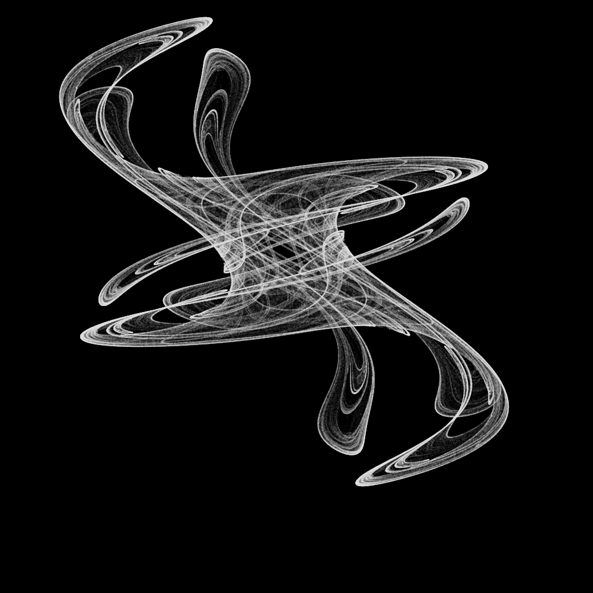

# movingAttractor

Read more about this in my blog post [here](https://gumeo.github.io/post/visualizing-strange-attractors/). I built this on Ubuntu 16.04, you will need to have openGL to compile this.

For using this type `make` and then `./tool` in the terminal. This version only produces the results in a viewing window, if you want to save the images to a file, uncomment the line number 223, which is using `screenshot_ppm` to save the images. Be careful then to also define what the files should be called and where they should be saved.

## Further developments with Claude

The project was extended using [Claude Code](https://claude.ai/claude-code) to add a number of new features. Build and run with:

```bash
make
./attractor --help
```

### Multiple attractor types

Pass `--type` to select an attractor:

| Name | Flag |
|------|------|
| King's Dream (original) | `--type kings_dream` |
| Clifford | `--type clifford` |
| De Jong | `--type de_jong` |
| Bedhead | `--type bedhead` |
| Svensson | `--type svensson` |

### Color modes

Pass `--color` to choose a coloring strategy:

| Mode | Description |
|------|-------------|
| `mono` | Single color, configurable via `--mono-r/g/b` (default: white) |
| `hue_cycle` | Cycles through hues as iterations progress |
| `velocity` | Colors by how fast the point is moving |
| `angle` | Colors by the direction of movement |

Tune the hue sweep with `--hue-start` and `--hue-range` (both 0–1).

### Generating a video

```bash
mkdir frames
./attractor --save --output frames --frames 600 --color hue_cycle --width 1920 --height 1080
ffmpeg -r 30 -i frames/%05d.ppm -c:v libx264 -pix_fmt yuv420p -crf 18 output.mp4
```

Key parameters:

| Flag | Default | Description |
|------|---------|-------------|
| `--width` / `--height` | 1000 | Output resolution |
| `--frames` | 600 | Total frames to render |
| `--iterations` | 2000000 | Points plotted per frame |
| `--delta` | 0.1 | Amplitude of parameter oscillation |
| `--alpha` | 0.02 | Point transparency |

### Interactive exploration

Launch with `-I` for a live view with a HUD and keyboard controls:

```bash
./attractor --interactive --type clifford --color hue_cycle
```

| Key | Action |
|-----|--------|
| `1`–`5` | Switch attractor type |
| `c` | Cycle color mode |
| `Q/q` `W/w` `E/e` `R/r` | Increase/decrease params `a` `b` `c` `d` |
| `+` / `-` | More / fewer iterations |
| `A` / `a` | Increase / decrease alpha |
| `H` | Toggle HUD overlay |
| `S` | Save current frame to output dir |
| `0` | Reset params to attractor defaults |
| `Space` | Pause / resume animation |
| `ESC` | Exit |

The following is an example of rendered output, check the link above to see the animation in action.

<center>
  
</center>
